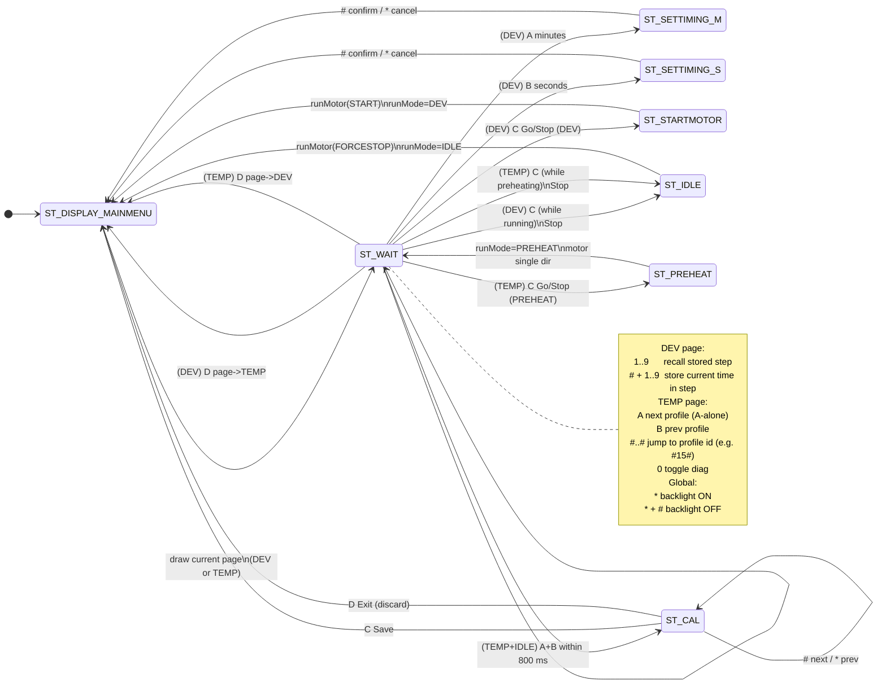

# FPP-3 Film/Paper Processor - Arduino Controller (v5.1.2)

Author: Luis Samaniego

FPP-3 is an Arduino UNO based controller for a home-built rotary film/paper processor
(JOBO tanks). It drives a DC motor through an H-bridge, shows DEV/TEMP information on
a 20x4 I2C LCD, and is operated via a 4x4 keypad.

This repository contains:
- `rotary_processor.ino` : current firmware (v5.1.2 tag)
- `src_old/`             : archived older firmware versions (v3, v4, etc.)

-------------------------------------------------------------------------------

## Features (v5.1.2)

- Two user pages:
  - DEV page: timing + motor run/stop + step recall/store
  - TEMP page: temperature monitoring + profile selection + PREHEAT start/stop
- Rotary motor control:
  - Smooth acceleration/braking
  - Periodic direction reversal
- EEPROM persistence:
  - Last used timing (min/sec)
  - Last selected profile
  - Calibration offsets (0.1 C) for Bath/Tank/Bottle and Heater (HTR)
  - 9 development step presets (1..9)
- DS18B20 temperature sensors (1-wire) via OneWire + DallasTemperature
  - ROM-based assignment (addresses stored in code)
  - Kodak thermometer reference offsets stored in EEPROM (0.1 C)
- Darkroom mode:
  - LCD backlight toggle via keypad combo

-------------------------------------------------------------------------------

## Hardware overview

Typical build:
- Arduino UNO (or compatible)
- IBT-2 / BTS7960 H-bridge motor driver
- DC motor driving JOBO roller base
- 20x4 I2C LCD (LiquidCrystal_I2C)
- 4x4 matrix keypad
- Buzzer
- DS18B20 sensors (Bath, Tank, Bottle) on one 1-wire bus

Power:
- 12 V for motor (via external supply)
- 5 V for UNO + sensors (via DC-DC converter)

IMPORTANT:
- Keep motor power and logic power grounds common (single reference).
- Keep sensor wiring neat; use proper pull-up on the 1-wire data line.

-------------------------------------------------------------------------------

## Arduino libraries

Required includes (as used in v5.1.2):
- <Wire.h>
- <LiquidCrystal_I2C.h>
- <Keypad.h>
- <EEPROM.h>
- <OneWire.h>
- <DallasTemperature.h>

Install missing libs in Arduino IDE:
Tools -> Manage Libraries...
Search and install:
- "OneWire" (Paul Stoffregen)
- "DallasTemperature" (Miles Burton)

-------------------------------------------------------------------------------

## DS18B20 wiring (1-wire)

- DS18B20 VDD -> +5V
- DS18B20 GND -> GND
- DS18B20 DQ  -> chosen Arduino pin (your "DG" / data pin)
- Pull-up resistor between DQ and +5V:
  - Typical: 4.7 kOhm (5% OK)
  - 100 nF ceramic capacitor between +5V and GND near the sensor side.

-------------------------------------------------------------------------------

## User interface

### Pages and modes

- Pages:
  - PAGE_DEV  : development timing + motor control
  - PAGE_TEMP : temperature monitoring + PREHEAT + profile selection
- Run modes:
  - MODE_IDLE     : not running
  - MODE_DEV      : motor running with countdown
  - MODE_PREHEAT  : temperature preheat control active
- Calibration:
  - CAL mode entered from TEMP page when IDLE (see below)

LCD menu row (20 chars) follows the v5.1 patched UX:
- DEV page: shows A/B timing, C Go/Stop, D Pg
- TEMP page: shows A/B profile, C Go/Stop (PREHEAT), D Pg

-------------------------------------------------------------------------------

## Keypad commands

Keypad has: digits 0..9, A/B/C/D, * and #.

### Global (works from ST_WAIT)

| Keys          | Action |
|--------------|--------|
| `*`          | If backlight OFF: turn ON. If ON: arm "OFF combo". |
| `*` then `#` | Turn LCD backlight OFF (darkroom). Must be within ~1 s. |

### DEV page (PAGE_DEV)

| Keys                 | Action |
|---------------------|--------|
| `A`                 | Edit minutes (enter minute edit state) |
| `B`                 | Edit seconds (enter second edit state) |
| `C`                 | Go/Stop DEV run (toggle) |
| `D`                 | Switch page DEV <-> TEMP |
| `1..9`              | Recall stored step (if defined) |
| `#` then `1..9`     | Store current time into step slot 1..9 |

Notes:
- "Store step" is a short sub-mode: press `#`, then one digit 1..9.

### TEMP page (PAGE_TEMP), MODE_IDLE

| Keys                 | Action |
|---------------------|--------|
| `A`                 | Profile forward (cycle) |
| `B`                 | Profile backward (cycle) |
| `C`                 | Start/Stop PREHEAT (toggle) |
| `D`                 | Switch page TEMP <-> DEV |
| `0`                 | Toggle TEMP diagnostics display (if enabled in firmware) |
| `# ... #`           | Jump to profile by ID (1-2 digits) e.g. `#15#` |

Profile jump notes:
- Start: press `#`
- Enter 1 or 2 digits (profile ID)
- Confirm: press `#` again
- Example: `#1#`, `#9#`, `#15#`

### Enter CAL mode (TEMP page, IDLE only)

CAL entry combo (kept as in v5.1 patched UX):
- Press `A` then `B` within ~800 ms -> enter CAL.

### CAL mode keys (all CAL pages)

| Keys     | Action |
|----------|--------|
| `A`      | +0.1 C |
| `B`      | -0.1 C |
| `C`      | Save (write to EEPROM) |
| `D`      | Exit (discard) |
| `#`      | Next CAL page |
| `*`      | Previous CAL page |

CAL pages include:
- HTR (heater suggested setting)
- Bath/Tank/Bottle offsets (Kodak reference)

-------------------------------------------------------------------------------

## Profiles

`profiles[]` defines the working presets (film and paper).

In v5.1.2 you use (example):

- Film:
  - BW  25.0 C  (typical)
  - C41 38.0 C
  - E6  38.0 C
- Paper:
  - BW  20.0 C
  - RA4 35.0 C
  with small volumes and different mixing dynamics.

Each profile includes:
- `id`                (shown/used for jump selection)
- chemistry label     ("BW ", "C41", "E6 ", "RA4")
- setpoint (0.1 C)
- tank code (e.g., 2521, 2551, 2561, 2821, ...)
- chemistry volume (mL)
- `dT_pour_10`        initial pour cooling in 0.1 C (developer enters cooler)
- boost time (s)      optional pre-boost window
- `dT_boost_10`       optional boost magnitude in 0.1 C

Operational meaning:
- `dT_pour_10` is applied once at DEV start as the initial condition for Tdev*.
- The lag model (Tdev*) then relaxes toward the chosen driver temperature.

-------------------------------------------------------------------------------

## State machine (high-level)

GitHub renders Mermaid diagrams in Markdown.

flowchart LR
  DEVPG[PAGE_DEV] <-->|D| TEMPPG[PAGE_TEMP]

  DEVPG --> DEVK["A: minutes\nB: seconds\nC: Go/Stop DEV\n1..9: recall step\n#: store step"]
  TEMPPG --> TEMPK["A: next profile\nB: prev profile\nA+B: CAL (only IDLE)\nC: Preheat start/stop\n#..#: jump profile\n0: diag\nD: back to DEV"]

  GLOBAL["Global:\n*: backlight on\n* then #: backlight off"] --- DEVPG
  GLOBAL --- TEMPPG
-------------------------------------------------------------------------------

## How it operates (typical workflow)

### A) Film development (DEV run)
1. Switch to DEV page (key `D` if needed).
2. Select a chemistry/tank profile (normally from TEMP page, then return to DEV).
3. Set development time:
   - `A` -> enter minutes, type digits, `#` to finish, `*` to cancel
   - `B` -> enter seconds, type digits, `#` to finish, `*` to cancel
4. Start development rotation:
   - Press `C` (Go). Motor starts, countdown begins.
5. Optional: store this time as a preset step:
   - Press `#` then `1..9`
6. End:
   - Motor stops automatically at 00:00.
   - A short beep occurs ~5 s before end (one-shot).
   - Menu returns after a short delay.

### B) Preheating (TEMP run)
1. Switch to TEMP page (`D` if needed).
2. Choose the profile (setpoint) that matches your process.
3. Press `C` to start PREHEAT rotation.
4. Wait until Bath temperature stabilizes in-band (READY latch).
5. Stop PREHEAT:
   - Press `C` again.

### C) Calibration (match DS18B20 to Kodak reference)
1. TEMP page must be active and MODE_IDLE (not preheating, not developing).
2. Enter CAL:
   - Press `A` then `B` within ~800 ms.
3. Navigate CAL pages:
   - `#` next, `*` previous
4. Adjust offset:
   - `A` +0.1 C, `B` -0.1 C
5. Save:
   - `C` writes offsets to EEPROM
6. Exit without saving:
   - `D` discards and returns

Recommended practice:
- Calibrate Bath, Tank, Bottle at the temperatures you actually use (e.g. 20C and 38C),
  because small sensor non-linearities can exist.

-------------------------------------------------------------------------------

## Installation

### 1) Software prerequisites
- Arduino IDE (2.x recommended)
- Board: Arduino UNO (or UNO-compatible)

Libraries used in v5.1.2:
- Wire
- LiquidCrystal_I2C
- Keypad
- EEPROM
- OneWire
- DallasTemperature

Install missing libraries:
Arduino IDE -> Tools -> Manage Libraries...
Search and install:
- "OneWire" (Paul Stoffregen)
- "DallasTemperature" (Miles Burton)

### 2) Build configuration (firmware switches)
In the sketch header:
- `USE_DS18B20`
  - 0: simulated/proxy temps
  - 1: real DS18B20 reads (DallasTemperature)
- `DS18B20_SCAN`
  - 1: prints ROM scan to Serial (for mapping sensors)

Serial:
- Baud: 57600

### 3) DS18B20 wiring (1-wire)
- DS18B20 VDD -> +5V
- DS18B20 GND -> GND
- DS18B20 DQ  -> chosen Arduino pin (1-wire data)
- Pull-up resistor between DQ and +5V:
  - typical: 4.7 kOhm (recommended)
  - 5.1 kOhm often works for short cables but 4.7 k is the default

Optional (recommended with long cables / noise):
- 100 nF ceramic capacitor between +5V and GND near the sensor end.

### 4) First-time sensor mapping
1. Enable ROM scan (if not already):
   - `USE_DS18B20 = 1`
   - `DS18B20_SCAN = 1`
2. Upload firmware.
3. Open Serial Monitor (57600 baud).
4. Copy the ROM code printed for each sensor and paste into:
   - `addrBath`, `addrTank`, `addrBottle`
5. Label cables physically (recommended):
   - "Bh", "Tk", "Bo"

### 5) EEPROM reset (optional)
If you change EEPROM structure version, the firmware resets settings automatically
when `settings.version != SETTINGS_VERSION`.

-------------------------------------------------------------------------------
## Software overview

Main components:

- State machine with the following states (see figure):

  - `ST_DISPLAY_MAINMENU`
  - `ST_WAIT`
  - `ST_SETTIMING_M` (edit minutes)
  - `ST_SETTIMING_S` (edit seconds)
  - `ST_STARTMOTOR`
  - `ST_IDLE`

- Motor control:
  - Bidirectional rotation (CW / CCW)
  - Acceleration, constant speed, and braking phases
  - Direction reversal after `nFullRev` tank revolutions

- EEPROM persistence:
  - `tMinutes`, `tSeconds` (last-used timing)
  - 9 development steps (1..9) with minutes, seconds, and "defined" flag

The main loop performs:

1. Reads the potentiometer and updates tank RPM (with anti-jitter filter).
2. Calls `runMotor(MOTOR_CONTINUE)` to maintain motor state.
3. Updates the countdown display while the motor is running.
4. Handles keypad input depending on the current state.

---

## Keypad operation

The controller uses a 4x4 keypad with:

- Digits: 0..9
- Function keys: `A`, `B`, `C`, `D`, `*`, `#`

### Key commands by state

#### Main waiting state (`ST_WAIT`)

| State | Key        | Effect                                                         |
|-------|------------|----------------------------------------------------------------|
| WAIT  | `*`        | If backlight is OFF: turn ON. If ON: arm backlight OFF combo. |
| WAIT  | `*` then `#` (within 1 s) | Turn LCD backlight OFF (for darkroom use).      |
| WAIT  | `#`        | Enter "store mode" for development steps.                     |
| WAIT  | store + `1`..`9` | Store current time (min, sec) into step slot 1..9.      |
| WAIT  | `1`..`9`   | Recall stored step 1..9 (if defined) and load its timing.     |
| WAIT  | `A`        | Edit minutes (enter `ST_SETTIMING_M`).                         |
| WAIT  | `B`        | Edit seconds (enter `ST_SETTIMING_S`).                         |
| WAIT  | `C`        | Start motor with current timing.                               |
| WAIT  | `D`        | Stop motor (emergency/normal stop).                            |

Notes:

- Backlight ON: press `*`.
- Backlight OFF: press `*`, then `#` within about 1 second.
- Development steps:
  - Store: `#` then digit 1..9.
  - Recall: press digit 1..9 directly.

#### Timing edit states (`ST_SETTIMING_M` and `ST_SETTIMING_S`)

When editing minutes or seconds, the lower line shows:

- `# Finish    * Cancel`

| State      | Key       | Effect                                          |
|------------|-----------|-------------------------------------------------|
| SET_M/S    | digits    | Type numeric value (minutes or seconds).        |
| SET_M/S    | `#`       | Finish entry, apply value, return to main menu. |
| SET_M/S    | `*`       | Cancel entry, keep previous value, return.      |

---

## Installation

1. Open the Arduino IDE.
2. Load the FPP-3 sketch (`.ino`) into the IDE.
3. Ensure the following libraries are installed:
   - Wire.h (bundled with Arduino)
   - EEPROM.h (bundled with Arduino)
   - LiquidCrystal_I2C (common third-party library)
   - Keypad (Arduino keypad library)
4. Select the correct board (Arduino UNO) and serial port.
5. Compile and upload the sketch.
6. Connect the USB port of the Arduino UNO to the FPP controller if needed
   for power and/or debugging via the Serial Monitor.

---

## Licensing

- FPP-3 software is licensed under the GNU General Public License,
  version 3 or (at your option) any later version.
  See the file `COPYING` for the full license text.

- FPP-3 hardware design files (mechanical and electrical) are licensed
  under the license documented in `LICENSE-HARDWARE.md`.

- Additional details and third-party attributions are documented in
  `LICENSE.md`.

